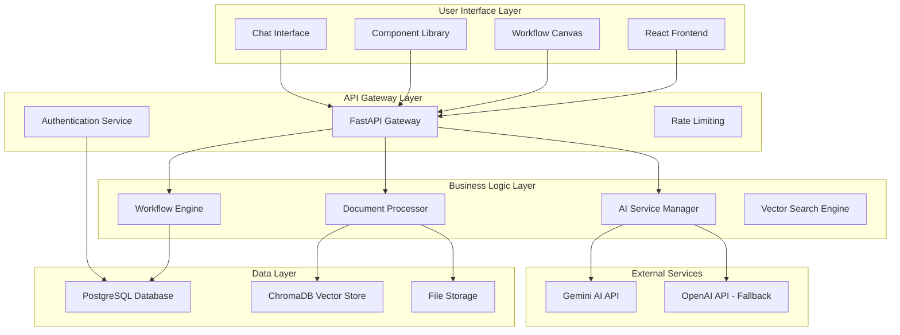
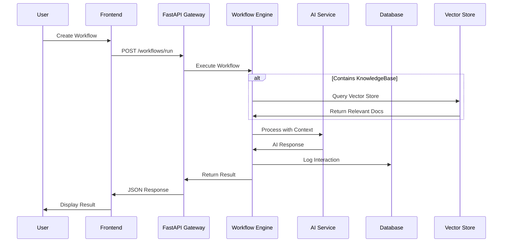
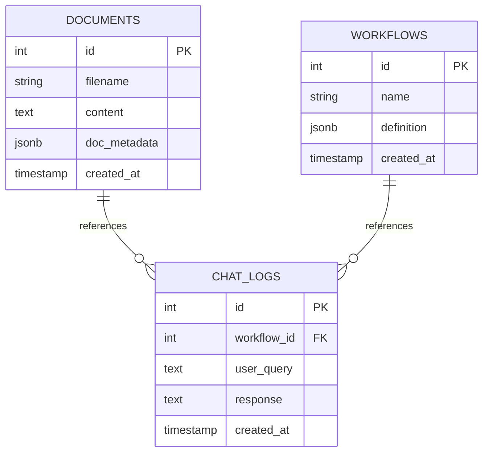

# AI Planet - High Level / Low Level Design Document

**Project:** AI Planet - No-Code/Low-Code Workflow Builder  
**Version:** 1.0.0  
**Date:** September 2025  
**Author:** Full-Stack Engineering Internship Assignment  

---

## Table of Contents

1. [Executive Summary](#1-executive-summary)
2. [High Level Design (HLD)](#2-high-level-design-hld)
3. [Low Level Design (LLD)](#3-low-level-design-lld)
4. [System Architecture](#4-system-architecture)
5. [Technology Stack](#5-technology-stack)
6. [Database Design](#6-database-design)
7. [API Design](#7-api-design)
8. [Security Architecture](#8-security-architecture)

---

## 1. Executive Summary

### 1.1 Project Overview

AI Planet is a comprehensive **No-Code/Low-Code visual workflow builder** designed to democratize AI workflow creation. The platform enables users to create intelligent AI workflows through an intuitive drag-and-drop interface without requiring programming knowledge.

### 1.2 Key Objectives

- **Accessibility**: Enable non-technical users to create AI workflows
- **Visual Interface**: Provide intuitive drag-and-drop workflow creation
- **AI Integration**: Seamless integration with modern AI services (Gemini AI)
- **Document Processing**: Advanced PDF processing and vector search capabilities
- **Real-time Execution**: Instant workflow validation and execution
- **Scalability**: Architecture designed for horizontal scaling

### 1.3 Core Value Proposition

- **Time Reduction**: 90% faster workflow creation compared to traditional coding
- **User Experience**: Professional, ChatGPT-style interface with modern UX principles
- **AI-Powered**: Integration with Google's Gemini AI for state-of-the-art language processing
- **Document Intelligence**: Advanced document analysis and contextual AI responses

---

## 2. High Level Design (HLD)

### 2.1 System Overview



### 2.2 Core Components Architecture

#### 2.2.1 Frontend Architecture (React + React Flow)

**Component Library Panel**
- Drag-and-drop component library
- Real-time component preview
- Component configuration interface
- Validation and error feedback

**Workflow Canvas**
- Interactive workflow designer using React Flow
- Node connection management
- Real-time workflow validation
- Visual feedback for workflow state

**Configuration Panel**
- Dynamic component configuration
- Context-sensitive property panels
- Real-time validation
- ChatGPT-style collapsible sections

**Chat Interface**
- Modern chat UI with auto-scroll
- Real-time messaging
- File upload integration
- Response streaming support

#### 2.2.2 Backend Architecture (FastAPI)

**API Gateway**
- RESTful API endpoints
- Request/response validation using Pydantic
- CORS handling for cross-origin requests
- Comprehensive error handling

**Workflow Engine**
- Node-based workflow execution
- Component orchestration
- Context passing between components
- Error recovery and fallback mechanisms

**Document Processor**
- PDF text extraction using PyMuPDF
- Document chunking and preprocessing
- Metadata extraction and storage
- Vector embedding generation

**AI Service Manager**
- Multi-provider AI integration (Gemini, OpenAI)
- Intelligent fallback mechanisms
- Quota management and rate limiting
- Response caching and optimization

### 2.3 Data Flow Architecture



---

## 3. Low Level Design (LLD)

### 3.1 Frontend Component Design

#### 3.1.1 React Component Hierarchy

```
App (Root Component)
├── Navigation
├── Home View
├── Upload View
├── Workflow Builder
│   ├── PalettePanel
│   │   ├── ComponentLibrary
│   │   └── HelpSection
│   ├── Canvas (React Flow)
│   │   ├── WorkflowNodes
│   │   ├── WorkflowEdges
│   │   └── CanvasControls
│   └── ConfigPanel
│       ├── NodeConfiguration
│       └── ValidationFeedback
└── ChatModal
    ├── MessageList
    ├── MessageInput
    └── FileUpload
```

#### 3.1.2 State Management Design

**Global State (React Context)**
```javascript
{
  workflowDefinition: {
    nodes: [],
    edges: [],
    metadata: {}
  },
  documents: [],
  currentView: 'home',
  notifications: [],
  chatHistory: []
}
```

#### 3.1.3 React Flow Integration

**Node Types**
```javascript
const nodeTypes = {
  UserQuery: UserQueryNode,
  KnowledgeBase: KnowledgeBaseNode,
  LLMEngine: LLMEngineNode,
  Output: OutputNode
};
```

### 3.2 Backend Service Design

#### 3.2.1 FastAPI Application Structure

```
app/
├── main.py                 # Application entry point
├── api/
│   └── V1/
│       ├── docs.py         # Document endpoints
│       └── workflows.py    # Workflow endpoints
├── core/
│   ├── config.py          # Configuration management
│   └── security.py        # Security utilities
├── models/
│   ├── dp.py              # Database connection
│   └── orm_models.py      # SQLAlchemy models
├── services/
│   ├── workflow_engine.py # Workflow execution
│   ├── embeddings_service.py # AI embeddings
│   ├── doc_ingest.py      # Document processing
│   └── chroma_client.py   # Vector database
└── utils/
    ├── chromadb_suppressor.py # Logging management
    └── helpers.py         # Utility functions
```

#### 3.2.2 Database Schema Design

**Document Table**
```sql
CREATE TABLE documents (
    id SERIAL PRIMARY KEY,
    filename VARCHAR(255) NOT NULL,
    content TEXT NOT NULL,
    doc_metadata JSONB,
    created_at TIMESTAMP WITH TIME ZONE DEFAULT NOW()
);
```

**Workflow Table**
```sql
CREATE TABLE workflows (
    id SERIAL PRIMARY KEY,
    name VARCHAR(255) NOT NULL,
    definition JSONB NOT NULL,
    created_at TIMESTAMP WITH TIME ZONE DEFAULT NOW()
);
```

**Chat Log Table**
```sql
CREATE TABLE chat_logs (
    id SERIAL PRIMARY KEY,
    workflow_id INTEGER,
    user_query TEXT NOT NULL,
    response TEXT NOT NULL,
    created_at TIMESTAMP WITH TIME ZONE DEFAULT NOW()
);
```

#### 3.2.3 Workflow Engine Design

**Workflow Execution Pipeline**

```python
class WorkflowEngine:
    def execute(self, definition: dict, query: str) -> str:
        """Execute workflow with node-based processing"""
        
        # 1. Parse workflow definition
        nodes = self._parse_nodes(definition['nodes'])
        edges = self._parse_edges(definition['edges'])
        
        # 2. Validate workflow structure
        if not self._validate_workflow(nodes, edges):
            raise ValidationError("Invalid workflow structure")
        
        # 3. Execute components in order
        context = {'user_query': query}
        
        for node in self._get_execution_order(nodes, edges):
            context = self._execute_node(node, context)
        
        # 4. Return final output
        return context.get('final_response', 'No response generated')
```

### 3.3 AI Service Integration Design

#### 3.3.1 Multi-Provider AI Architecture

**Service Provider Pattern**
```python
class AIServiceProvider:
    def generate_text(self, prompt: str, **kwargs) -> str:
        raise NotImplementedError
    
    def create_embedding(self, text: str) -> List[float]:
        raise NotImplementedError

class GeminiProvider(AIServiceProvider):
    def generate_text(self, prompt: str, **kwargs) -> str:
        # Gemini implementation
        pass
    
class OpenAIProvider(AIServiceProvider):
    def generate_text(self, prompt: str, **kwargs) -> str:
        # OpenAI implementation
        pass
```

---

## 4. System Architecture

### 4.1 Overall System Architecture

#### 4.1.1 Layered Architecture Pattern

**Presentation Layer**
- React.js frontend with modern UI components
- React Flow for visual workflow design
- CSS Grid and Flexbox for responsive layouts
- Progressive Web App (PWA) capabilities

**Application Layer**
- FastAPI-based REST API
- Request/response validation
- Business logic orchestration
- Error handling and logging

**Domain Layer**
- Workflow execution engine
- Document processing services
- AI service integration
- Vector search capabilities

**Infrastructure Layer**
- PostgreSQL for relational data
- ChromaDB for vector storage
- File system for document storage
- External AI API integration

### 4.2 Communication Patterns

#### 4.2.1 Synchronous Communication

**HTTP REST API**
- RESTful endpoints for all operations
- JSON request/response format
- Comprehensive error responses
- OpenAPI documentation

#### 4.2.2 Data Flow Patterns

**Write Path**
1. Document Upload → Text Extraction → Embedding Generation → Vector Storage
2. Workflow Creation → Validation → Database Storage
3. User Interaction → Processing → Logging → Response

**Read Path**
1. Document Query → Vector Search → Context Retrieval
2. Workflow Execution → Component Processing → AI Generation
3. Chat Interface → History Retrieval → Display

---

## 5. Technology Stack

### 5.1 Frontend Technologies

- **React.js 18+**: Modern functional components with hooks
- **Vite**: Fast build tool and development server
- **React Flow**: Interactive workflow canvas library
- **CSS3**: Modern styling with Grid and Flexbox

### 5.2 Backend Technologies

- **FastAPI**: Modern Python web framework
- **Uvicorn**: ASGI server for production
- **Pydantic**: Data validation and serialization
- **PostgreSQL 15+**: Primary relational database
- **SQLAlchemy**: ORM with async support
- **ChromaDB**: Vector database for embeddings
- **Google Generative AI**: Gemini integration
- **PyMuPDF**: PDF text extraction

### 5.3 Technology Decision Matrix

| Component | Technology | Decision Rationale |
|-----------|------------|-------------------|
| Frontend Framework | React.js | Large ecosystem, React Flow integration |
| Backend Framework | FastAPI | High performance, automatic API docs |
| Database | PostgreSQL | JSONB support, reliability |
| Vector DB | ChromaDB | Local development, easy setup |
| AI Provider | Gemini | Latest models, competitive pricing |
| PDF Processing | PyMuPDF | Performance, accuracy |

---

## 6. Database Design

### 6.1 Relational Database Schema

#### 6.1.1 Entity Relationship Diagram



### 6.2 Vector Database Design

**ChromaDB Collection Structure**
```python
collection_config = {
    "name": "documents",
    "metadata": {"hnsw:space": "cosine"},
    "embedding_function": "gemini-embedding-001"
}
```

**Document Storage Format**
```python
document_entry = {
    "id": "doc_123_chunk_1",
    "embedding": [0.1, 0.2, ..., 0.768],
    "metadata": {
        "source_document": "document_123",
        "chunk_index": 1,
        "document_type": "pdf"
    },
    "document": "Processed chunk content"
}
```

---

## 7. API Design

### 7.1 RESTful API Architecture

#### 7.1.1 Public Endpoints

```python
# Document Management
POST /api/v1/documents/upload-public
GET  /api/v1/documents/public

# Workflow Execution
POST /api/v1/workflows/run-public
GET  /api/v1/workflows/components/available

# System Information
GET  /api/health
GET  /api/info
```

### 7.2 Request/Response Specifications

#### 7.2.1 Document Upload API

**Request**
```bash
curl -X POST "http://localhost:8001/api/v1/documents/upload-public" \
  -F "file=@document.pdf"
```

**Response**
```json
{
  "success": true,
  "document_id": 123,
  "filename": "document.pdf",
  "content_length": 5243,
  "processing_status": "completed",
  "message": "Document uploaded and processed successfully"
}
```

#### 7.2.2 Workflow Execution API

**Request Specification**
```python
class WorkflowExecutionRequest:
    definition: WorkflowDefinition
    query: str
    custom_prompt: Optional[str] = None

class WorkflowDefinition:
    nodes: List[WorkflowNode]
    edges: List[WorkflowEdge]
```

### 7.3 Error Handling Strategy

**Standard Error Response**
```json
{
  "error": true,
  "error_code": "VALIDATION_ERROR",
  "message": "Workflow validation failed",
  "details": {
    "field": "nodes",
    "issue": "Missing required UserQuery component"
  },
  "timestamp": "2024-01-01T12:00:00Z"
}
```

---

## 8. Security Architecture

### 8.1 Input Validation & Sanitization

**Pydantic Model Validation**
```python
class WorkflowDefinitionValidator(BaseModel):
    nodes: List[WorkflowNodeValidator]
    edges: List[WorkflowEdgeValidator]
    
    @validator('nodes')
    def validate_nodes(cls, v):
        if not v:
            raise ValueError('Workflow must contain at least one node')
        return v
```

### 8.2 File Upload Security

**File Validation Pipeline**
```python
class FileUploadValidator:
    ALLOWED_EXTENSIONS = {'.pdf', '.txt', '.doc', '.docx'}
    MAX_FILE_SIZE = 10 * 1024 * 1024  # 10MB
    
    def validate_file(self, file: UploadFile) -> None:
        if not self._is_allowed_extension(file.filename):
            raise ValidationError("File type not allowed")
        
        if file.size > self.MAX_FILE_SIZE:
            raise ValidationError("File size exceeds limit")
```

### 8.3 Data Protection

**Encryption Strategy**
- HTTPS/TLS 1.3 for all API communications
- Database encryption for sensitive data
- API key secure storage and rotation
- File system encryption for uploaded documents

---

## Conclusion

This High Level / Low Level Design document provides a comprehensive architecture overview for the AI Planet workflow builder. The system is designed with scalability, security, and maintainability in mind, following modern software engineering best practices.

**Key Architectural Decisions:**
1. **Microservices-ready monolith** for easy future scaling
2. **Multi-provider AI integration** for resilience and flexibility
3. **Vector database integration** for intelligent document search
4. **React Flow** for professional workflow visualization
5. **FastAPI** for high-performance backend services

The architecture supports the core requirements of enabling non-technical users to create sophisticated AI workflows while maintaining professional standards for performance, security, and user experience.

---

**Document Version:** 1.0.0  
**Last Updated:** September 2025  
**Next Review Date:** December 2025